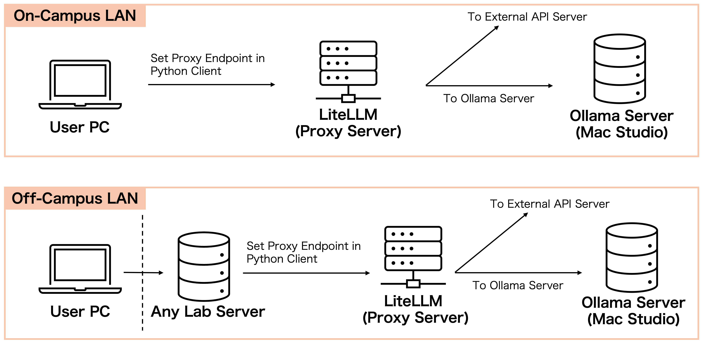

# MacStudio LocalLLM Platform


This repository documents an **on‑prem LLM platform** built around a lab Mac Studio using **Ollama + LiteLLM Proxy**. It provides a secure, OpenAI‑compatible API for both local models and closed providers, with centralized admin control over models and storage. 

## Overview
- **Goal**: Enable lab members to use local LLMs and closed models (OpenAI/Anthropic/Gemini) via a single API
- **Design**: Only admins manage models; users access via API
- **Operations**: Tiered storage for capacity/cost/performance balance

## Architecture

```
[User PC] --(OpenAI-Compatible API)--> [LiteLLM Proxy :<PORT>]
                                         |  AuthZ / Model alias
                                         v
                                  [Ollama Servers]
                        Internal SSD:<PORT>  External SSD:<PORT>  NAS:<PORT>
```

## Core Components
- **LiteLLM Proxy**: AuthZ + model aliasing. Exposes OpenAI‑compatible API
- **Ollama**: Local model runtime. Separate endpoints per storage tier
- **screen**: Multi-user sessions to keep proxy and servers resident

## Usage
### From inside campus network
```python
from openai import OpenAI

client = OpenAI(
    base_url="http://<macstudio-host>:<proxy-port>",  # LiteLLM Proxy
    api_key="litellm",  # Dummy key for local models
)

response = client.chat.completions.create(
    model="<local-model-alias>",  # Use LiteLLM model_name alias
    messages=[{"role": "user", "content": "こんにちは!"}],
    temperature=0.7,
)

print(response.choices[0].message.content)
```

### From outside campus network
Remote SSH into a lab server, then run API calls from there.
```python
from openai import OpenAI

client = OpenAI(
    base_url="http://<macstudio-lan-host>:<proxy-port>",
    api_key="litellm",
)

response = client.chat.completions.create(
    model="<local-model-alias>",
    messages=[{"role": "user", "content": "こんにちは!"}],
)
```

### Closed providers (OpenAI / Anthropic / Gemini)
```python
from openai import OpenAI

client = OpenAI(
    base_url="http://<macstudio-host>:<proxy-port>",
    api_key="<your_api_key>",
)

response = client.chat.completions.create(
    model="<provider>/<model>",  # Follow LiteLLM provider naming
    messages=[{"role": "user", "content": "こんにちは!"}],
)
```

## Configured Models (redacted)
### Open models
- `<open-model-1>` (alias: `<alias-1>`)
- `<open-model-2>` (alias: `<alias-2>`)
- `<open-model-3>` (alias: `<alias-3>`)

Note: By default, **context length is limited to 4096 tokens** in Ollama. We experimentally set `num_ctx=10000`.

### Closed models
- OpenAI / Anthropic / Gemini
- Allowed via wildcard entries in LiteLLM `model_list`

## Operational Rules (excerpt)
- **Only admins load models**; users access via API
- **LiteLLM config lives under `<shared-config-path>`**; admins can edit
- **Restart LiteLLM** after config updates
- **Requests are processed sequentially** by Ollama (parallelism unverified)

## Storage Policy
- Internal SSD: 1TB (OS/system only)
- External SSD: 8TB (`<external-ssd-primary-path>`) primary model storage
- External SSD: 2TB (`<external-ssd-secondary-path>`)
- NAS: 10TB (`<nas-user-mount-path>`) low‑frequency models/data

### Rules
- Low‑frequency models and training data → NAS
- High‑frequency models → external SSD
- Internal SSD reserved for system data

## Restart Checklist
### LiteLLM Proxy
```bash
screen -S litellm_proxy
# Ctrl+A → :multiuser on
# Ctrl+A → :acladd <user>
litellm --config litellm_config.yaml
# Ctrl+A → D
```

### Ollama (external SSD)
```bash
screen -S ollama_ssdt5_server
# Ctrl+A → :multiuser on
# Ctrl+A → :acladd <user>
export OLLAMA_MODELS="<external-ssd-models-path>"
export OLLAMA_HOST="0.0.0.0:<ollama-port>"
ollama serve
# Ctrl+A → D
```

### Remount NAS
```bash
mount_smbfs "//<nas-user>@<nas-host>/<share>" <nas-mount-path>
```

## Admin Setup (excerpt)
### Ollama
```bash
ollama pull <model-name>
ollama pull <hf-model-path>
```

### LiteLLM config example
```yaml
model_list:
  - model_name: <local-model-alias-1>
    litellm_params:
      model: ollama/<local-model-1>
      api_base: "http://localhost:<ollama-port>"
  - model_name: <local-model-alias-2>
    litellm_params:
      model: ollama/<local-model-2>
      api_base: "http://localhost:<ollama-port>"
```

### Allow closed providers (example)
```yaml
model_list:
  - model_name: openai/*
    litellm_params:
      model: openai/*
  - model_name: anthropic/*
    litellm_params:
      model: anthropic/*
  - model_name: gemini/*
    litellm_params:
      model: gemini/*
```

## Design Rationale
- **API compatibility** minimizes user learning cost
- **Proxy‑based authorization** prevents model sprawl and resource pressure
- **Tiered storage** balances capacity constraints and performance


## Security Note
IP addresses, hostnames, and port numbers are intentionally **redacted**. Replace placeholders only in secured internal documents.
